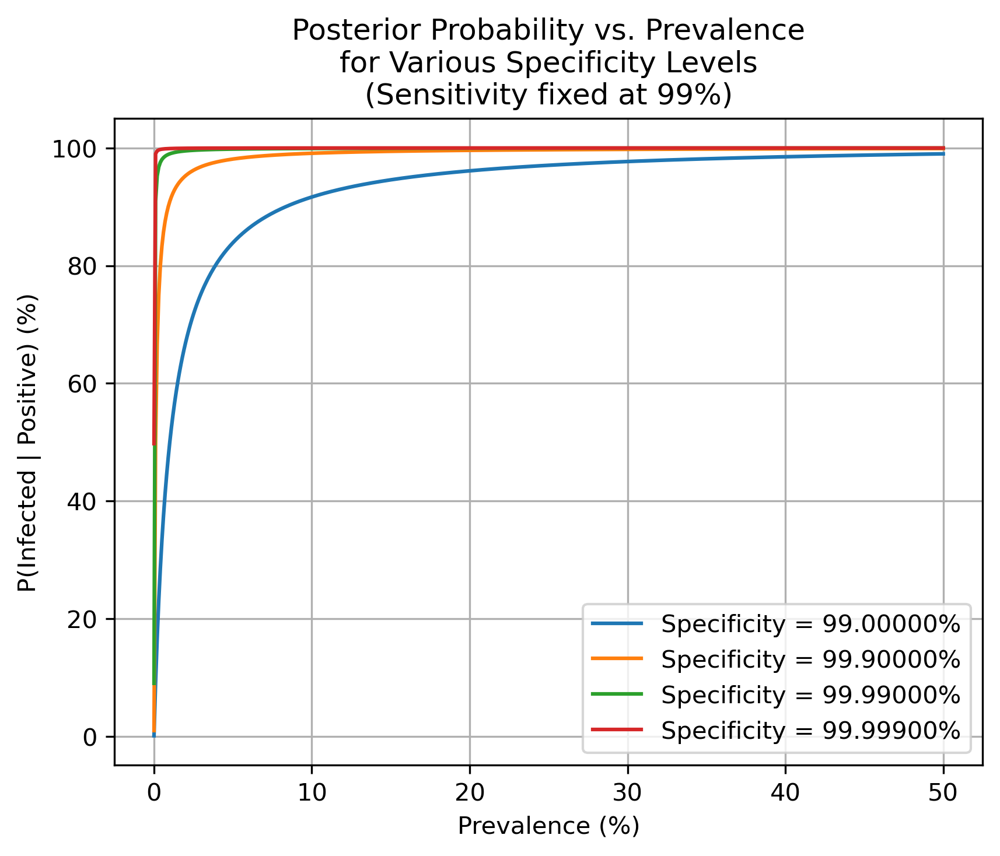

# Modular-i-offline-activity
## SARS-CoV-2 Rapid Self-Test PPV Visualization

The following plot shows how the positive predictive value (PPV) changes with prevalence from 0.001% to 50%, at a fixed sensitivity of 99%, for different specificity levels (99%, 99.9%, 99.99%, and 99.999%):



> **Figure note:** The x-axis is prevalence (%), the y-axis is P(infected | positive) (%). Higher specificity curves lie closer to the top.

---

### Integer Simulation Example

Below is the integer‐based simulation output for a sample size of N = 10 000, with prevalence 5%, specificity 99.5%, and sensitivity 99%:

```text
Out of 10000 people, with prevalence 5.0%:
  Infected: 500, Uninfected: 9500
  True Positives: 495, False Positives: 47
Posterior P(infected | +) ≈ 91.33%
